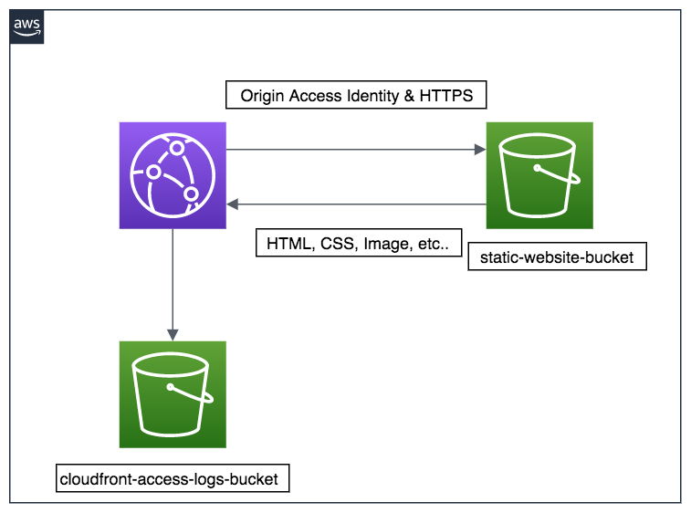

# simple

## Architecture

- diagram of Architecture(documents/architecture.xml and documents/architecture.png) is created by [draw.io](https://www.draw.io/)

## Restricting Access to Amazon S3 Content

- Use origin access identity

## HTTPS

### Redirect HTTP to HTTPS

### Not configure S3 bucket as website endpoint

https://docs.aws.amazon.com/AmazonCloudFront/latest/DeveloperGuide/using-https-cloudfront-to-s3-origin.html  
> If your Amazon S3 bucket is configured as a website endpoint, you can't configure CloudFront to use HTTPS to communicate with your origin because Amazon S3 doesn't support HTTPS connections in that configuration.

